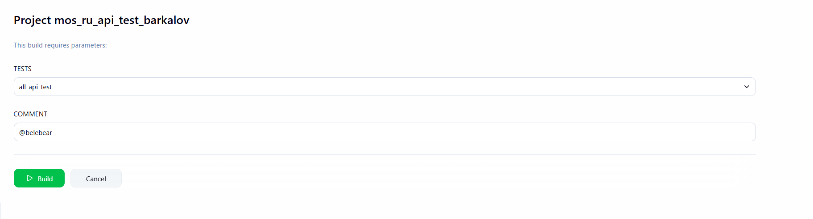
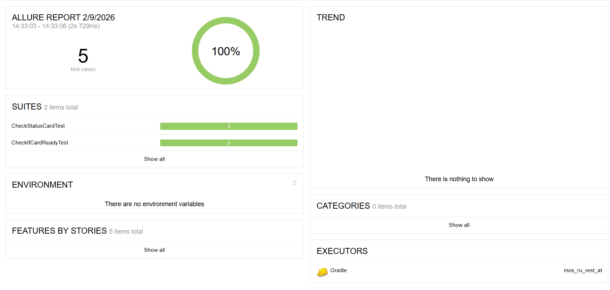
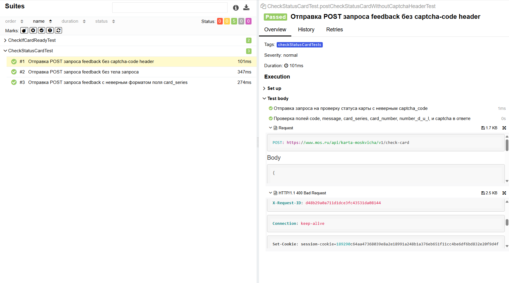

# Автоматизированные тесты API для сервиса [Mos.ru](https://www.mos.ru)

## <a name="Технологии и инструменты">**Технологии и инструменты:**</a>

<p align="center">  
<a href="https://www.jetbrains.com/idea/"></a>  
<a href="https://www.java.com/"></a>
<a href="https://rest-assured.io/"></a>
<a href="https://github.com/"></a>  
<a href="https://junit.org/junit5/"></a>  
<a href="https://gradle.org/"></a>  
<a href="ht[images](images)tps://github.com/allure-framework/allure2"></a> 
<a href="https://qameta.io/"></a>   
<a href="https://www.jenkins.io/"></a>  
</p>

## Примеры автоматизированных тест-кейсов:
- Тестирование Api готовности карты москвича
- Тестирование Api статуса карты москвича
- Тестирование Api обратной связи

---

## Запуск тестов через терминал:

#### Для локального запуска
- Запуск API тестов на проверку готовности карты москвича
``` bash 
gradle clean ready_test
```
- Запуск API тестов на проверку статуса карты москвича
``` bash 
gradle clean status_test
```
- Запуск API тестов на проверку обратной связи
``` bash 
gradle clean feedback_test
```
- Запуск всех API тестов
``` bash 
gradle clean all_api_test // Запуск всех API тестов
```

#### Для запуска из Jenkins
``` bash 
clean ${TESTS}
```

## Сборка в [Jenkins](https://jenkins.autotests.cloud/job/38-belebear-rigla_project_lesson12/) 

### Возможные параметры сборки в Jenkins:
<p align="center">  

</p>

- TESTS - параметр отвечающий за запуск по тестовой модели
- COMMENT - параметр, отвечающий за сообщение, которое будет отправлено в телеграм с отчетом

## Отчетность в [Allure](https://jenkins.autotests.cloud/job/38-belebear-rigla_project_lesson12/allure/) 

### Главная страница Allure Reports

<p align="center">  

</p>

### Страница со всеми тест-кейсами и шагами

<p align="center">  

</p>

### По итогу прохождения тестов формируются:
- Лог запроса
- Лог ответа или ошибки
## Отчетность в Telegram 

### Краткий отчет после прохождения тестов от чат-бота

<p align="center">  

</p>
